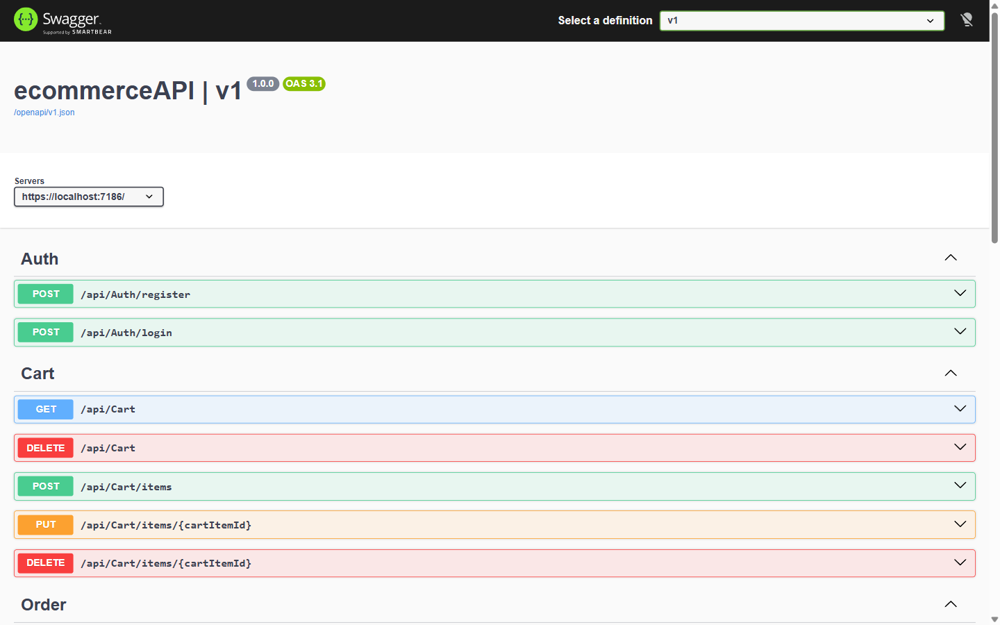

# ShopVerse — Backend API (.NET)

> The ShopVerse REST API: a JWT-secured e-commerce backend with products, cart, orders, wishlist and reviews, built on a clean 3-layer architecture (API → Business Logic → Data Access).




---

## Features

- **Authentication** — register/login with ASP.NET Core Identity, JWT Bearer tokens with role claims (Admin / Customer)
- **Product API** — paginated listing with filtering, text search, categories, brands, and product reviews
- **Cart API** — user-scoped cart with incremental quantity, stock validation, update/remove/clear
- **Order API** — checkout from cart with price snapshots and discount handling, order history, admin order-status updates
- **Wishlist API** — idempotent add/remove with a unique (user, product) constraint
- **Stock management** — quantity validated against stock on add and decremented atomically on order creation
- **Resilience & DX** — global exception middleware (RFC 7807 ProblemDetails), automatic input validation, auto-migrations + demo seeding on startup
- **DummyJSON seeding** — the dev database is seeded from the public DummyJSON API (194 products, 24 categories, 64 brands, 580+ reviews with real product photos) plus demo users, carts, orders and wishlists

## Tech Stack

| Layer | Technology |
|---|---|
| API (ecommerceAPI) | ASP.NET Core Web API, JWT Bearer, Swagger/OpenAPI, FluentValidation |
| Business Logic (ecommerceAPI-BLL) | Service layer, DTOs, AutoMapper 13, FluentValidation 11 |
| Data Access (ecommerceAPI-DAL) | EF Core 10, SQL Server, Repository + Unit of Work, database seeder |
| Auth | ASP.NET Core Identity + JWT (issuer `ecommerce-api`) |

## Architecture

The API follows a strict **3-layer architecture** with one-directional dependencies: **API → BLL → DAL**. Controllers only handle HTTP concerns and delegate to services; services contain all business rules and never touch `DbContext` directly — every query goes through a generic **Repository + Unit of Work** pattern. Responses are DTOs mapped with AutoMapper, requests are validated automatically by FluentValidation, and all errors surface as consistent ProblemDetails via a global exception middleware. This structure keeps business logic isolated, testable, and independent of both HTTP and persistence concerns.

```
ecommerceAPI.slnx
├── ecommerceAPI/          # Controllers, middleware, Program.cs, appsettings
├── ecommerceAPI-BLL/      # Services, DTOs, validators, AutoMapper profiles
└── ecommerceAPI-DAL/      # EF Core DbContext, entities, repositories, seeder
```

## Getting Started

### Prerequisites

- .NET 10 SDK
- SQL Server Express (`localhost\SQLEXPRESS`) or LocalDB

### 1. Clone & configure

```bash
git clone https://github.com/marwaasamy/ecommerce-API.git
cd ecommerce-API

# appsettings.json is gitignored — copy the example, then set a JWT signing key:
Copy-Item ecommerceAPI/appsettings.Example.json ecommerceAPI/appsettings.json
dotnet user-secrets set "Jwt:Key" "a-long-random-string-of-32+-characters" --project ecommerceAPI
```

### 2. Run

```bash
dotnet run --project ecommerceAPI
```

On first startup the database is created, migrated and seeded from the DummyJSON API: 194 products, 24 categories, 64 brands, 580+ reviews and demo users (an internet connection is required for seeding).

- Swagger UI: `https://localhost:7186/swagger/index.html`
- HTTP endpoint: `http://localhost:5091`

### Demo accounts

| Role | Email | Password |
|---|---|---|
| Customer | `john@test.com` | `P@ssw0rd1` |
| Admin | `admin@ecommerce.com` | `Admin@123` |

## Project Status

Personal/portfolio project — **not deployed to production**. Runs locally against a seeded SQL Server database. There is currently no CI pipeline.

## Related Repo

- **[ShopVerse UI](https://github.com/Andrew702/ecommerce-UI)** — the Angular storefront that consumes this API

## Contact

[GitHub — Andrew702](https://github.com/Andrew702)
